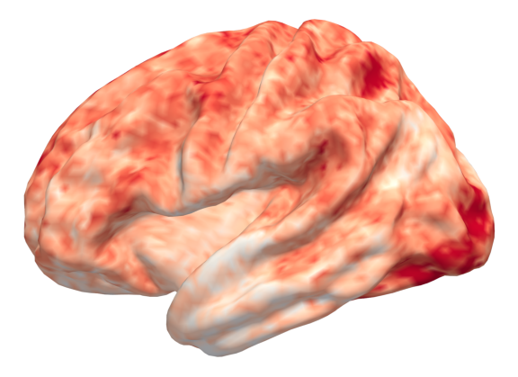
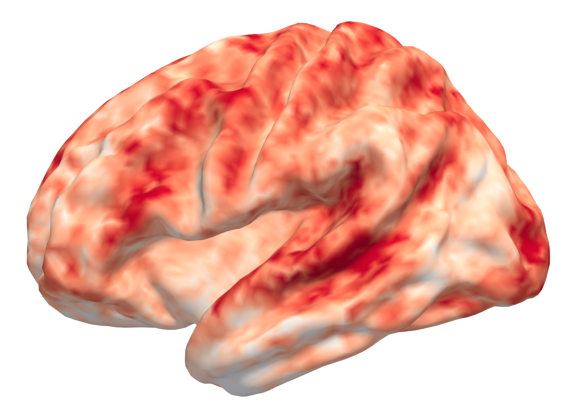
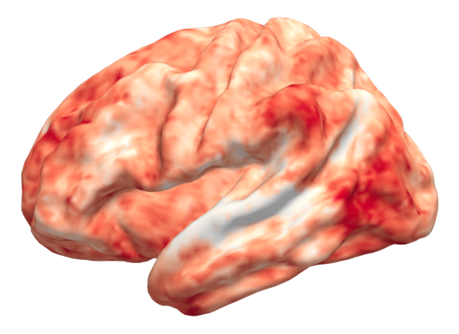
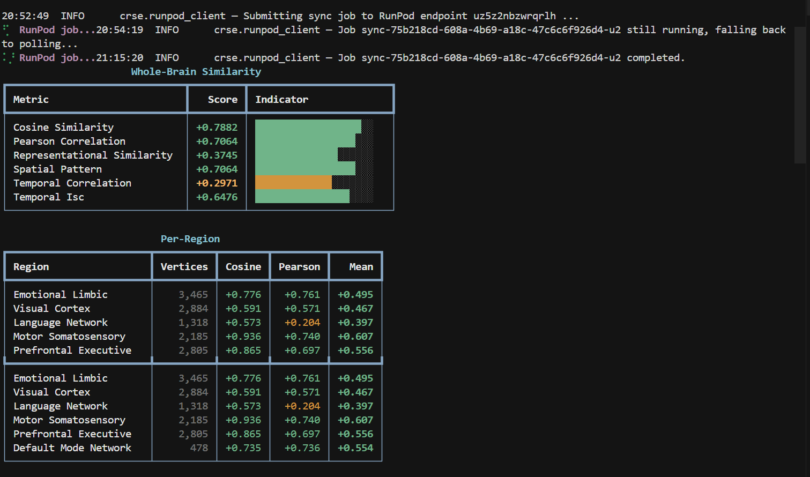

# Cognitive Response Similarity Engine (CRSE)

Compare two videos with [Meta TRIBE v2](https://github.com/facebookresearch/tribev2): predicted cortical responses (fsaverage5), similarity metrics, **cortical PNGs by default**, and optional **full timecourses + WebGL brain viewer**.

**Python ≥ 3.11** · MIT (code) · TRIBE weights [CC-BY-NC-4.0](https://huggingface.co/facebook/tribev2)

---

## Install

```bash
git clone https://github.com/facebookresearch/tribev2.git
uv pip install torch torchvision --index-url https://download.pytorch.org/whl/cu124   # or /cpu
uv pip install -e ./tribev2
uv pip install -e ".[tribe-plot]"   # required for cortical PNGs + RunPod worker
uv run python -m spacy download en_core_web_sm
```

Accept [facebook/tribev2](https://huggingface.co/facebook/tribev2) and [meta-llama/Llama-3.2-3B](https://huggingface.co/meta-llama/Llama-3.2-3B) on Hugging Face, then `huggingface-cli login` or set `HF_TOKEN`.

---

## CLI (local)

```bash
# Writes scores to the terminal + cortical PNGs under ./crse_out/brain/
crse compare video_a.mp4 video_b.mp4

# Custom output root
crse compare a.mp4 b.mp4 --out-dir ./my_run

# Full (T×V) predictions + interactive 3D viewer under OUT_DIR/viewer/
crse compare a.mp4 b.mp4 --render-brain

# Lean JSON (no base64)
crse compare a.mp4 b.mp4 -o scores.json
```

**3D viewer:** browsers block `file://` data loads. Serve the folder, then open `index.html`:

```bash
cd crse_out/viewer && python -m http.server 8765
# http://localhost:8765/
```

---

## CLI (RunPod)

Two **public URLs** (not local paths). Every job returns PNGs as `surface_pngs_base64`; the CLI decodes them into `--out-dir/brain/`.

```bash
export RUNPOD_API_KEY=...
export CRSE_ENDPOINT_ID=...
crse compare --runpod "https://..." "https://..." --out-dir ./crse_out

# Large API response: full predictions + local viewer build
crse compare --runpod URL_A URL_B --render-brain --out-dir ./crse_out
```

Build/push the worker: `docker build -t your/crse-worker -f runpod/Dockerfile .`  
Template env: `HF_TOKEN`, optional `CRSE_CACHE_DIR=/cache` (see Dockerfile).

---

## Python

```python
from pathlib import Path
from crse import CRSEngine

engine = CRSEngine()
result = engine.compare(
    "a.mp4",
    "b.mp4",
    out_dir=Path("crse_out"),       # None on serverless worker
    render_brain=False,             # True → viewer/ + series binaries
)
print(result.whole_brain)
result.save("scores.json")          # never embeds PNG/npz base64
```

RunPod client:

```python
from crse.runpod_client import CRSERunPodClient

r = CRSERunPodClient().compare("https://...", "https://...", render_brain=False)
# r["surface_pngs_base64"], r["whole_brain"], ...
```

---

## What you get


| Always                                                              | With `--render-brain`                                            |
| ------------------------------------------------------------------- | ---------------------------------------------------------------- |
| Similarity tables (whole-brain + regions)                           | Same                                                             |
| `OUT_DIR/brain/mean_a.png`, `mean_b.png`, `mean_diff_a_minus_b.png` | Same                                                             |
|                                                                     | `OUT_DIR/viewer/`: WebGL surface, scrub time, pick video A or B |


### Demo example (cortical maps + scores)

After `crse compare`, the same figures live under `crse_out/brain/` (or your `--out-dir/brain/`). Below is one real run: two demo videos (voice vs music), **left-hemisphere** time-mean surfaces and **A - B** difference, plus a **terminal** snapshot of whole-brain and per-region similarity.

| Mean map (video A) | Mean map (video B) |
| ------------------ | ------------------ |
|  |  |

| Difference **A - B** | Similarity tables (excerpt) |
| -------------------- | ---------------------------- |
|  |  |

---

## Metrics & regions

`crse regions` lists ROI keys. Similarity metrics include cosine, Pearson, temporal correlation, RSA, etc. (see `crse/similarity.py`).

---

## License & citation

CRSE: MIT. TRIBE v2 weights: non-commercial unless Meta grants otherwise. Cite TRIBE and this repo in academic work.